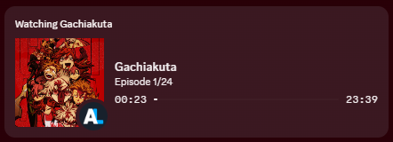

# Koushin 🌙

Koushin is a lightweight **Windows tray app** that reads what you're watching in **mpv** and shows it on **Discord Rich Presence** (cover art, episode, progress). If you sign in to **AniList/MAL**, it can also sync your progress.

It’s designed to be “download -> run -> forget it’s there”.

---

<p align="center">
  
</p>

---

## Features ✨

### Discord Rich Presence
- 🎬 Shows anime title + episode in Discord
- 🖼️ Uses AniList cover art when available
- ⏱️ Shows progress/timestamps (and updates while you seek)
- ⏸️ Paused playback shows as paused

### AniList/MAL integration (optional)
- 🔐 One-click sign-in from the tray
- ✅ Sync your AniList/MAL progress when you reach **~80% watched**
- 🪪 Optional AniList “profile badge” small icon in Discord (will add a MAL badge in a later update)
- 🔁 If the anime is **Completed** / **Repeating** on AniList/MAL, Discord will show **Rewatching** instead of Watching

### Quality-of-life
- 🛑 “Select correct anime…” manual override UI when Koushin detection is wrong
- ⚠️ Optional filler episode warnings (animefillerlist.com)
- 🔄 Built-in update checker
- 🪟 Windows startup toggle + Start Menu shortcut (so it shows in Windows Search)

### Simulwatching (host + join) 🧑‍🤝‍🧑
- Host a session and share your watch state with friends
- Join a friend’s session and mirror their state in your tray + Discord
- Joiners can optionally **Sync my AniList** from the host’s 80% progress events
- Works over the internet (may require port-forwarding; UPnP/NAT-PMP is attempted best-effort)

---

## Download / install 📥

1. Go to **Releases**: https://github.com/hyuzipt/Koushin/releases/latest
2. Download **`Koushin.exe`**
3. Run it (no installer)

Koushin will live in your **system tray**.

---

## mpv setup (required) 🎞️

Koushin talks to mpv through mpv’s IPC pipe. Do this once:

1. Press `Win + R` -> enter `%AppData%\\mpv`
2. Create or edit `mpv.conf`
3. Add this line:

```conf
input-ipc-server=\\.\pipe\mpv-pipe
```

4. Restart mpv

### Alternative: launch mpv with IPC once

```bash
mpv.exe --input-ipc-server=\\.\pipe\mpv-pipe "your-anime.mkv"
```

---

## First run / tray menu 🧷

Right-click the tray icon to access features like:

- **Sign in to AniList...** / **Sign out of AniList**
- **Enable Discord Rich Presence** (global toggle)
- **Show AniList profile in Discord RPC**
- **Warn for filler episodes**
- **Select correct anime...** (manual override)
- **Run on Windows startup**
- **Simulwatching** (Host / Join / Stop)
- **Check for updates...**
- **Quit**

On first run, Koushin also creates a Start Menu shortcut so it appears in Windows Search.

---

## AniList sign-in (optional) 🔐

From the tray menu: **Sign in to AniList...**

This enables:
- progress syncing at ~80%
- showing your AniList badge in Discord (optional)
- better cover art / metadata

---

## Simulwatching (Host / Join) 🧑‍🤝‍🧑

### Host
1. Tray -> **Simulwatching -> Host a Simul...**
2. A small browser page opens to enter a **code** (3–18 letters/numbers)
3. You’ll get an invite like `IP:PORT` + your **code**
3. Send it to your friend

If your friend can’t connect, you may need to port-forward that TCP port to your PC (Koushin tries UPnP/NAT-PMP but it’s not guaranteed).

### Join
1. Tray -> **Simulwatching -> Join a Simul...**
2. A small browser page opens
3. Paste the host `IP:PORT` and the code

While joined:
- your Discord + tray mirror the host state
- **Sync my AniList** becomes available (joiner-only)

### Participants
Koushin shows a live **Participants** count in the Simulwatching status line (host + joiners).

---

## Environment variables (optional) ⚙️

If you want to override defaults:

- `MPV_PIPE` — mpv IPC pipe path (default: `\\.\pipe\mpv-pipe`)
- `POLL_MS` — mpv polling interval in milliseconds (min ~200)
- `HTTP_USER_AGENT` — user agent used for AniList requests

---

## Where Koushin stores data 🗂️

Koushin stores config and mappings in your user config directory (AppData). Typical files include:

- `auth.json` (AniList token + settings)
- `overrides.json` (manual anime selections)
- `koushin.log` (debug log)

---

## Troubleshooting 🛠️

### Discord status not showing
- Make sure the **Discord desktop app** is running
- Discord -> Settings -> Activity Privacy -> enable “Share my activity”

### Discord Rich Presence is disabled
- Tray -> **Enable Discord Rich Presence**
- When disabled, Koushin will still update the tray tooltip and AniList sync (if enabled), but it will stop/clear Discord activity.

### mpv not detected
- Confirm `input-ipc-server=\\.\pipe\mpv-pipe` is in your `mpv.conf`
- Restart mpv after editing

### Wrong anime / wrong match
- Use **Select correct anime...** in the tray menu to pin the right AniList entry

### Filler warnings look wrong / everything is marked filler
- If animefillerlist.com doesn’t have a matching page for a show, Koushin will skip filler warnings for that anime (it will not mark everything as filler).

### Episode looks off by one (starts at 0)
- Some release groups name episodes `E00..E12`. Koushin detects that pattern and shifts it to `1..13`.

### Simulwatching can’t connect
- Most common cause: missing port-forward on the host’s router

---

## Build from source 🧰

```bash
git clone https://github.com/hyuzipt/Koushin.git
cd Koushin
go mod tidy
go build -trimpath -ldflags="-s -w -H=windowsgui" -o Koushin.exe
```

---

## License 📄

MIT
